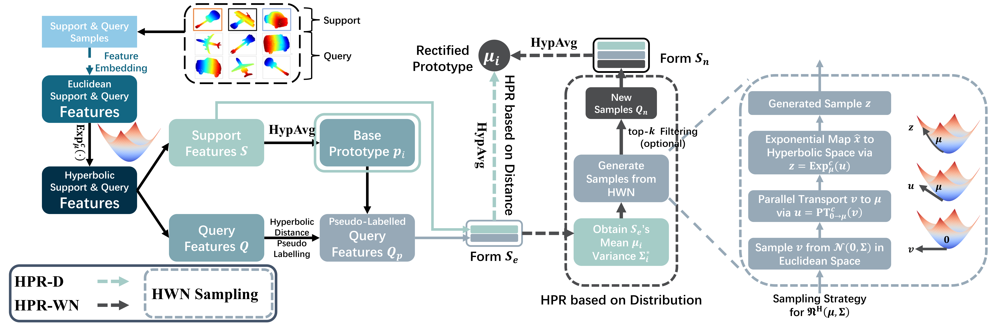

# Hyperbolic Prototype Rectification for Few-Shot 3D Point Cloud Classification



## Temporary Notes (2024.09.25)

* This is a preview version of our code, not the final version. The current version isn't named very well for fs_head. We are trying to reorganize the names to increase readability. 

* If schedules are met, The final version will be completed within a week (before Oct.1).

## Introduction

This repository includes the PyTorch implementation for our paper 
"[**Hyperbolic Prototype Rectification for Few-Shot 3D Point Clouds**](https://doi.org/10.1016/j.patcog.2024.111042)" 
accepted by [**Pattern Recognition**](https://www.sciencedirect.com/journal/pattern-recognition).

[2024.09.28] Final Version Online!

[2024.09.20] Accepted by Pattern Recognition!

## Installation

This project is built upon the following environment:
* Python 3.6
* CUDA 11.1
* PyTorch 1.10.2

We also tested on: 
* Python 3.11
* CUDA 12.4
* PyTorch 2.1

Therefore, it should be able to run on any settings in-between. 

Core operations on Hyperbolic Poincaré model can be found in `hyptorch/`

Few-Shot head and Backbone can be found in `model/`

## Datasets

All data used in this project is in .npy format.

* Download [ModelNet40](https://modelnet.cs.princeton.edu/)
* Download [ModelNet40-C (Zenedo)](https://zenodo.org/record/6017834#.YgNeKu7MK3J)
* Download [ScanObjectNN](https://hkust-vgd.github.io/scanobjectnn/)

Create a `data/` folder and organize the datasets as: 
```
data/
|–– h5_files/
|–– modelnet40_c/
|–– modelnet40_ply_hdf5_2048/
```

## Train
Train a model on the ModelNet40 dataset by
```
python main.py --dataset modelnet40 --fs_head hyper_proto
```

## Evaluate
```
python main.py --train False
```

## Acknowledgements

Part of the code is borrowed from [**Cross-Modality Feature Fusion Network**](https://github.com/LexieYang/Cross-Modality-Feature-Fusion-Network), thanks to their great work!

## Citation

If you find our work insightful or useful, please consider citing:
```
@article{HPR,
title = {Hyperbolic Prototype Rectification for Few-Shot 3D Point Cloud Classification},
journal = {Pattern Recognition},
volume = {158},
pages = {111042},
year = {2025},
author = {
    Yuan-Zhi Feng and Shing-Ho J. Lin and Xuan Tang and Mu-Yu Wang and Jian-Zhang Zheng and 
    Zi-Yao He and Zi-Yi Pang and Jian Yang and Ming-Song Chen and Xian Wei},
doi = {10.1016/j.patcog.2024.111042},
keywords = {
    Hyperbolic Geometry, Few-shot Learning, Point Cloud Classification, 
    Prototype Rectification, Feature Enhancement}
}
```

## Contact
Should you have any questions about this work, please feel free to contact me (Shing-Ho J. Lin) via: linchenghao21@mails.ucas.ac.cn
